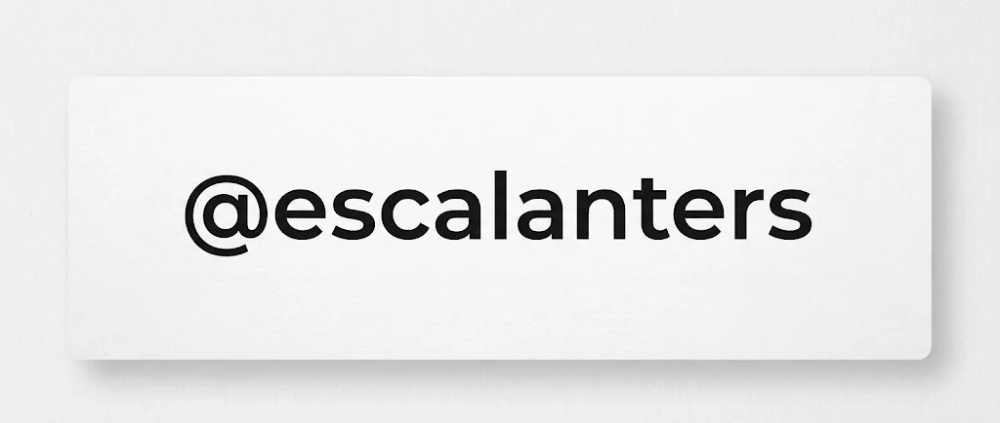

## ¡Hola! 👋

Me llamo Sebastian Escalante, soy desarrollador fullstack en [HyperLabs](https://www.hyperlabs.vc/) y estudiante de **Ingeniería de Software** en ITSON. 
###  Trabajando ahora
- **TeamUp**  reclutamiento de personal operativo a escala, en producción en [teamup.mx](https://teamup.mx).
- **PotroNET**  red social para la comunidad del ITSON, en [potronet.com](https://potronet.com).
- **IVirtual-Wrap** extensión del navegador que provee una UI mejorada en [ivirtual.itson.edu.mx](https://ivirtual.itson.edu.mx/)
- **FloreriaKO** ecommerce local en producción en [floreriako.com](https://www.floreriako.com/)

### Stack

### Contacto

[`sebastianescram01@gmail.com`](mailto:sebastianescram01@gmail.com) · [`in/escalanters`](https://www.linkedin.com/in/escalanters)
